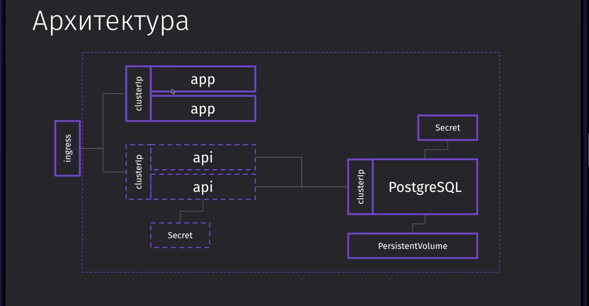

<!--
НА докер драйвере не работает ингресс и NodePort, qemu самый стабильный на маке любой версии (да и на винде походу тоже), но без --network socket_vmnet не будет работать ингресс и NodePort
Для ингресса обязательно включить аддон и прописать домент в /etc/hosts
brew install socket_vmnet
brew tap homebrew/services
HOMEBREW=$(which brew) && sudo ${HOMEBREW} services start socket_vmnet
-->

minikube start --driver qemu --network socket_vmnet

kubectl get all

kubectl apply -f .

kubectl describe pods short-app
kubectl logs pods/short-api-deployment-6896db6cd9-6jr9v

kubectl port-forward service/short-app-port 3000:3000
kubectl port-forward deployment/short-app-deployment 3000:80
kubectl port-forward pod/short-app-deployment-84d5999c6d-x4c79 3000:80

<!-- Нужно выполнить миграцию по созданию таблицы в поде с постгрей (иначе будет 500 от бека)
CREATE TABLE "Link" (
	"id" serial NOT NULL,
	"url" TEXT NOT NULL,
	"hash" TEXT NOT NULL
) -->
